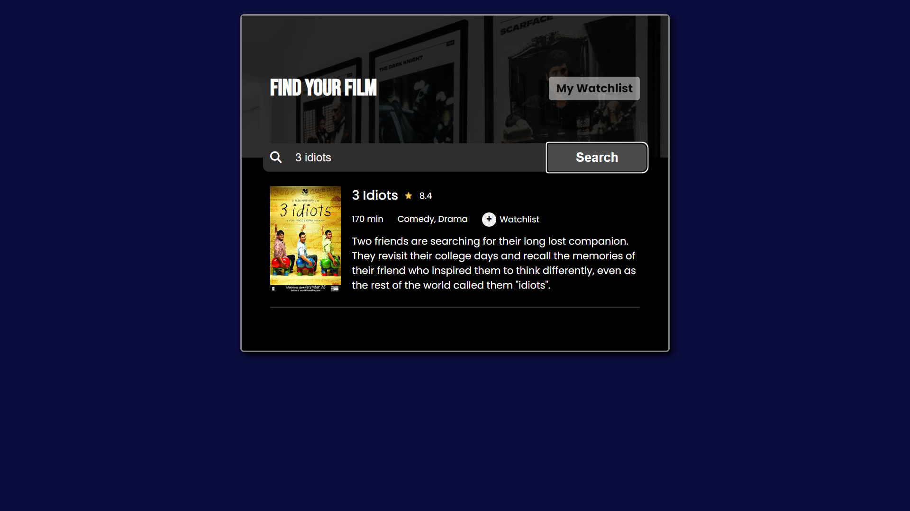
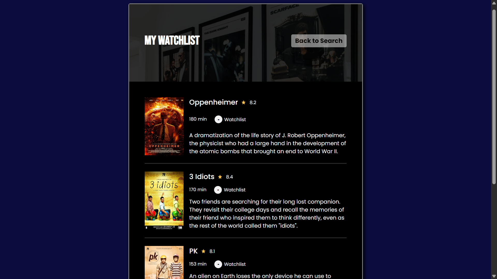

# Movie Watchlist App

## 📖 Overview
A simple web application to search movies using the **OMDb API** and save them to a personal watchlist.  
The app consists of two main pages:  
- `index.html` → Search page  
- `watchlist.html` → Watchlist page  

🔗 **Live Demo:** [Movie Watchlist on Netlify](https://patel-movie-watchlist.netlify.app/)

---

## ✨ Features
- **Search Movies**: Search movies by title using the OMDb API.  
- **Display Results**: Show search results with poster, title, year, rating, runtime, and description.  
- **Add to Watchlist**: Button to add movies to a watchlist, saved in localStorage.  
- **View Watchlist**: A separate page (`watchlist.html`) that loads and displays movies from localStorage.  

---

## 🛠 Tech Stack
- HTML, CSS, JavaScript  
- OMDb API for movie data  
- LocalStorage for persistence  

---

## 🚀 Usage
1. Open `index.html`.  
2. Search for a movie by entering its title.  
3. Click **"Add to Watchlist"** to save the movie.  
4. Open `watchlist.html` to view saved movies.  

---

## 📂 Project Structure
- `index.html` → Search page with input field and results display.  
- `watchlist.html` → Watchlist page that loads movies from localStorage.  
- `style.css` → Styling for both pages.  
- `script.js` → Handles API calls, DOM manipulation, and localStorage operations.  

---

## 📸 Screenshots
### Search Page (`index.html`)

### Watchlist Page (`watchlist.html`)

---

## 🔮 Future Improvements
- Add **Remove from Watchlist** functionality.  
- Show detailed movie info (Plot, Genre, Ratings) using `i=` API call.  
- Improve UI with responsive design and better layout.  
- Add sorting and filtering options for the watchlist.  

---

## ⚙️ Installation
1. Clone or download the repository.  
2. Place files (`index.html`, `watchlist.html`, `style.css`, `script.js`) in your project folder.  
3. Open `index.html` in your browser.  
4. Ensure you have an active internet connection for OMDb API calls.  

---

## 📜 License
This project is open-source and available under the **MIT License**.
